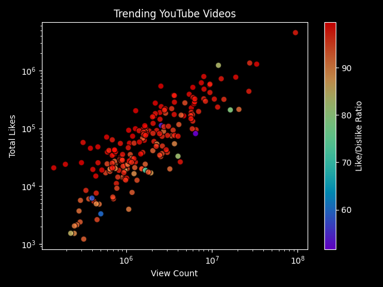
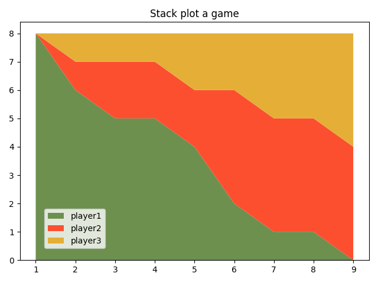
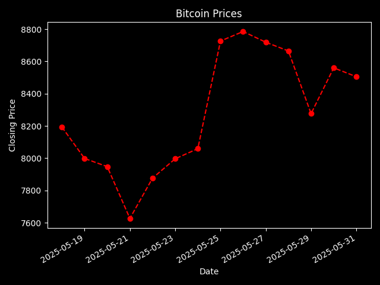
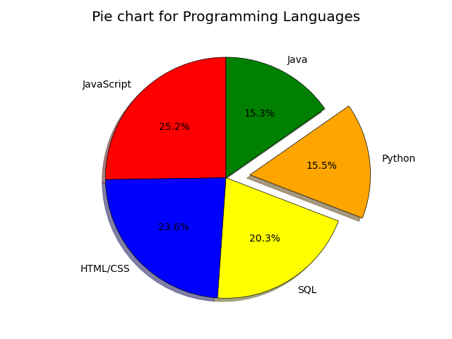

This repository is dedicated to my **hands-on learning and practice** with [Matplotlib](https://matplotlib.org/) — one of the most widely used data visualization libraries in Python.  

Matplotlib provides an extensive set of tools for creating a wide variety of plots, ranging from **basic line and bar charts** to **complex multi-plot layouts**. It’s highly customizable, supports different output formats (`.png`, `.jpg`, `.pdf`, etc.), and integrates well with libraries like **NumPy** and **Pandas**.  

Through this repo, I aim to **explore Matplotlib step by step** — starting from the basics (simple plots, labels, legends) and gradually moving into **styling, advanced customization, and real-world datasets**.  
This will serve as my **personal reference library** of examples, experiments, and reusable code snippets for future data analysis and machine learning projects.  

---

## 🎯 Why I Created This Repo
- To build a **solid foundation in data visualization** with Python.  
- To collect **all my practice scripts in one place** for future reference.  
- To explore different chart types, customizations, and tricks with Matplotlib.  
- To eventually use this knowledge in **data science, analytics, and ML projects**.  

---

## 🖼️ Gallery of Practice Plots  

Here are some of the plots I’ve created while learning Matplotlib:  

 ### 🔹 Example 1: Scatter Plot  

  
  

  
### 🔹 Example 2: Stack Plot
 

  

### 🔹 Example 3: Time Series Plot

  

### 🔹 Example 4: Pie Plot

  

